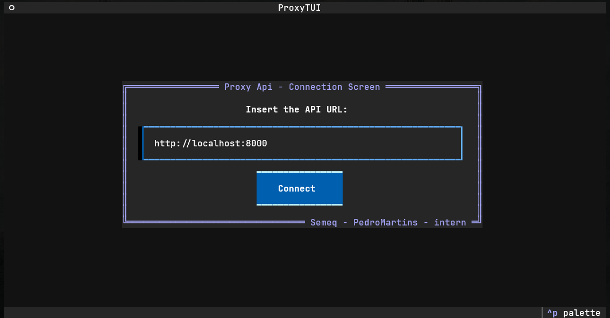
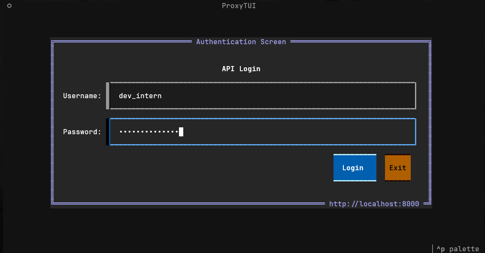
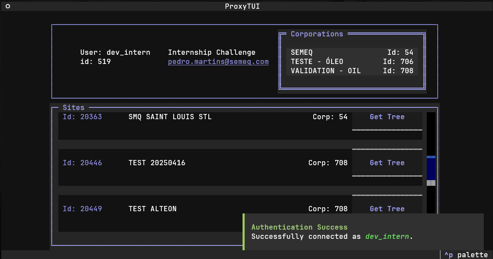
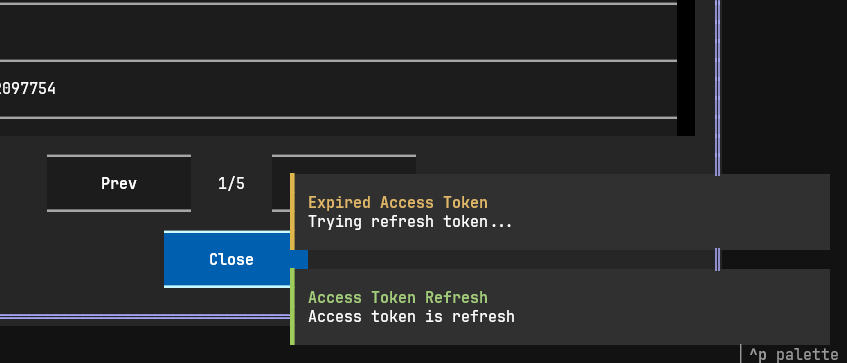
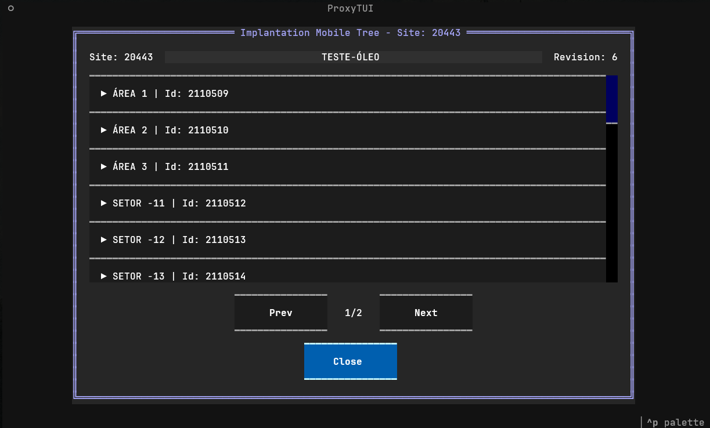
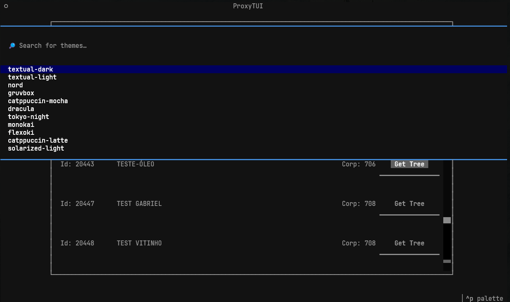
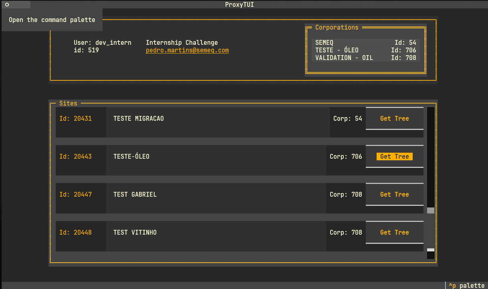
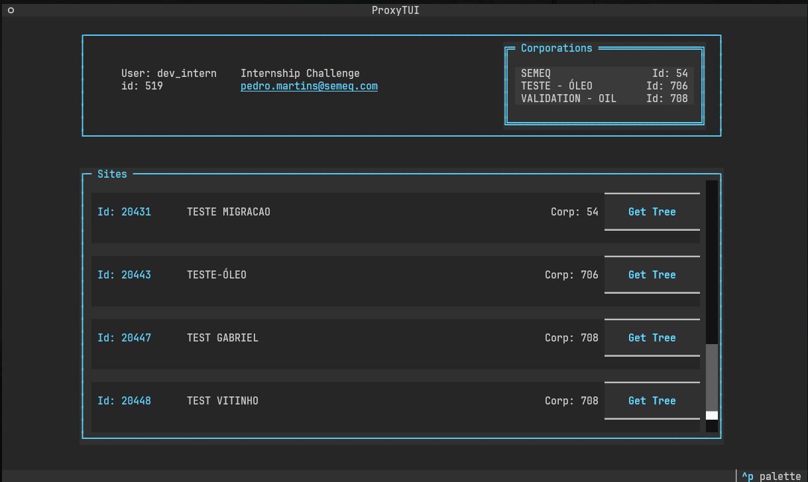
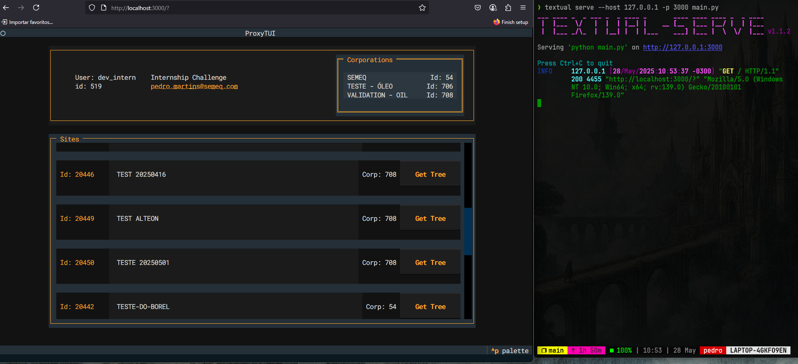

# Proxy API - Terminal User Interface (TUI)

This is the frontend client service of the application, built using **Textual**. 

### The TUI Features:
- **A simple to use terminal interface to connect with the backend:**



- **Authentication modal screen:**



- **A main screen with:**
  - Header filled with **usercorp** user information.
  - Scrollable box with user **associated corporations**.
  - Scrollable body with all user **associated sites**.



- **Access and refresh token session storage with access token refresh when expired.**



- **An accordion modal screen to visualize an user associated site tree:**



- **Different color schemes:**






---

## Running the TUI locally
### 1. Clone the repository
```bash
git clone https://github.com/pedro-martins-semeq/api-proxy-challenge
cd api-proxy-challenge/tui
```
### 2. Create and activate the virtual environment
You may use the `setup.sh` file to create a venv in a `.venv/` folder, activate it and install the dependencies listed in the `requirements.txt` file:
```bash
source setup.sh
``` 

#### OR

You may setup the environment manually with the following commands:

```bash
python3 -m venv .venv
source ./.venv/bin/activate
pip install -r requirements.txt
```

### 3. Start the TUI Application
You may start the application directly in your terminal window:
```bash
textual run main.py
```

#### OR

You may serve the application to access the interface in a web browser
```bash
textual serve --host 127.0.0.1 -p 3000 main.py
```

> With this command, the TUI will be available at:
> <br>http://127.0.0.1:3000 <br>
> Be sure that the port 3000 is available when serving the app or configure a port (`-p` parameter) of your choice.

### TUI Running on web browser:



---

## Notes
- This service uses `httpx` for HTTP requests ti external APIs.
- For more request formatting info: the `./src/api-client/api_client.py` module provides all the HTTP client app logic.